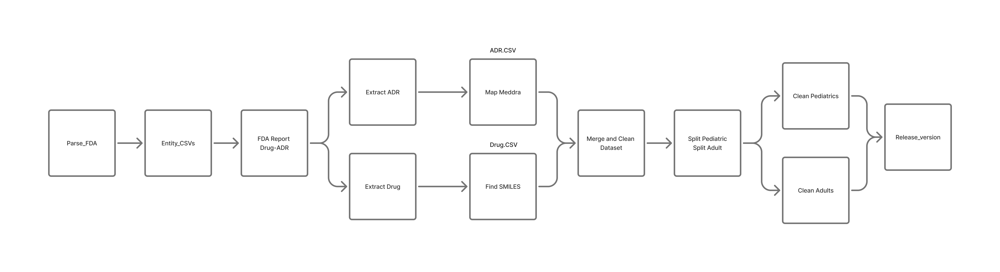

# FAERS Data Pipeline (openFDA -> ER -> Enrich -> Merge -> Release)

End-to-end pipeline for the FDA Adverse Event Reporting System (FAERS) built on openFDA drug event data. It converts raw JSON/CSV into Entity–Relationship (ER) tables, enriches with RxNav and optionally DrugBank, merges everything into an analysis-ready table, runs QA, and packages a release.

The pipeline can resume safely, skip stages with existing outputs, and provides offline/demo fallbacks for RxNav and the merge on low-resource environments.

## Workflow


Stages (as orchestrated by `run_pipeline.py`)
- Stage 1: Parse raw openFDA into normalized CSV folders (`core/Parsing.py`) — optional if ER exists
- Stage 2: Build ER tables from parsed folders (`core/openFDA_Entity_Relationship_Tables.py`)
- Stage 3: Merge baseline across patient/report/serious/reporter (`core/merge_data_all_ages.py`)
- Stage 4: Split dictionaries (ADR and Drug) (`split/split_adr.py`, `split/split_drug.py`)
- Stage 5: ADR -> MedDRA PT/SOC (`enrich/ADR.py` + OMOP vocab)
- Stage 6: Drug cleaning + RxNav mapping (`enrich/clean_drug.py`, `enrich/rxnav_enrich.py`)
- Stage 7: Merge back to final pairs + coverage (`stage4_merge_back.py`)
- Stage 8: Split cohorts by age (`stage5_split_cohorts.py`)
- Stage 9: QA artifacts (`stage6_qa_checks.py`)
- Stage 10: Package release (`stage7_release_pack.py`)

## Repository Layout
- ER/merge helpers: `core/*.py`, `merge/common_utils.py`
- Split/Enrich/QA/Release: `split/*.py`, `enrich/*.py`, `stage*.py`
- Driver: `run_pipeline.py` (all stages), `run_pipeline_validation.py` (sample run)
- Windows helper: `scripts/run_pipeline_cmd.bat` (conda env + cleanup + run)

## Requirements
- Python 3.10+
- Recommended: a Conda environment named `pipeline` with packages from `requirements.txt`.

Conda on Windows (recommended)
```cmd
conda create -n pipeline python=3.11 -y
conda activate pipeline
pip install -r requirements.txt
```

POSIX venv
```bash
bash scripts/setup_env.sh
source .venv/bin/activate
pip install -r requirements.txt
```

### OMOP Vocabulary
Place the vocabulary under `vocab/vocabulary_SNOMED_MEDDRA_RxNorm_ATC/` (or configure `--vocab-dir`). At minimum you need:
- `CONCEPT.csv` (or `.gz`)
- `CONCEPT_ANCESTOR.csv` (or `.gz`)

### openFDA Input
If you do not have parsed raw folders, you can run `core/Parsing.py` (needs an API token in `data/input/.openFDA.params`) or download prebuilt ER input with `core/dataset.py` (Hugging Face dataset snapshot). The pipeline will automatically skip Stage 1/2 when it finds ER tables under:
- `data/openFDA_drug_event/er_tables` (or `er_tables_memory_efficient`)

## Running the Pipeline
Default run (all stages, skipping what already exists):
```bash
python run_pipeline.py --no-confirm -y --qps 4 --max-workers 8
```

Useful flags
- `--vocab-dir PATH`     : Custom path to OMOP vocab directory
- `--suspect-only`       : Use only suspect drugs in Stage 4 split
- `--use-llm`            : Enable optional LLM-based cleaning in `enrich/clean_drug.py`
- `--llm-module NAME`    : Python module providing `llm_clean(list)->list`
- `--qps N`              : RxNav query-per-second rate limit (default 4)
- `--max-workers N`      : RxNav concurrency
- `--shards S --shard-id I` : Shard processing (advanced)
- `--age-col NAME`       : Age column used for cohort split (default `patient_custom_master_age`)
- `--until-stage N`      : Stop after stage N (1..10)
- `--force`              : Force re-run of stages even if outputs exist (see fallback below)
- `--demo-rxnav`         : Offline/demo RxNorm mapping (no network, standard library only)

Windows (Conda) quick run
```cmd
scripts\run_pipeline_cmd.bat
```
This script:
- activates the `pipeline` conda env,
- deletes large temporary indexes (e.g., `data\split\*_sid_index.sqlite`) and old logs/steps,
- installs requirements (best-effort),
- runs `run_pipeline.py`.

## Outputs (key files)
- `data/baseline/patients_report_serious_reporter.csv.gz`        : Baseline (Stage 3)
- `data/split/adr_map.csv.gz`, `data/split/drug_map.csv.gz`      : Dictionaries/maps (Stage 4)
- `data/enrich/standard_reactions*.csv.gz`                        : MedDRA PT/SOC (Stage 5)
- `data/enrich/drug_clean.csv.gz`, `data/enrich/drug_rxnorm.csv.gz` : Cleaned and RxNorm (Stage 6)
- `data/processed/FDA_patient_drug_report_reaction.csv.gz`       : Final merged pairs (Stage 7)
- `data/processed/pediatric.csv.gz`, `adults.csv.gz`, `age_unknown.csv.gz` : Cohorts (Stage 8)
- `data/qa/*`                                                     : QA artifacts (Stage 9)
- `data/release/<DATE>/MANIFEST.json`                             : Release manifest (Stage 10)

## Validation Run (sample)
`run_pipeline_validation.py` provides a smaller end-to-end test (Stage 3 -> 10). You can use it to verify your environment before running the full dataset.

Example
```bash
python run_pipeline_validation.py --sample-size 50 --qps 4 --max-workers 8
```

## RxNav & DrugBank
RxNav (online, default)
- The normal Stage 6 uses RxNav REST APIs with rate-limiting and a local cache (`data/enrich/rxnav_cache.sqlite`).

RxNav (offline/demo)
- Add `--demo-rxnav` to `run_pipeline.py` to generate a deterministic placeholder mapping without network or pandas. This is intended for CI / low-resource testing, not for production data quality.

DrugBank (optional)
- `enrich/production_drugbank_scraper.py` can add DrugBank IDs for INNs. It requires a Chrome/Chromium binary or Selenium Remote.
- You can merge DrugBank IDs in Stage 7 with `--drugbank ... --filter-drugbank` (see `stage4_merge_back.py`).

## Low-memory / Troubleshooting
- Out-of-memory while reading large CSVs in Stage 7: run the pipeline with `--force` to trigger the streaming fallback merger (no pandas). It will be slower but use much less memory.
- No network or RxNav unavailable: use `--demo-rxnav`.
- Disk space concerns: delete `data/split/adr_sid_index.sqlite`, `data/split/drug_sid_index.sqlite`, and old `data/logs/steps/` folders. The Windows helper batch does this automatically.
- ER tables not found: ensure they exist under `data/openFDA_drug_event/er_tables` or create them with Stage 1/2 scripts.

## Data Transfer (Google Drive)
- Upload artifacts via `scripts/upload_to_gdrive.py` using a JSON config (see `scripts/gdrive_upload.json`).
- Download prebuilt data via `scripts/fetch_openfda_data.py` (supports Google Drive `gdown` and HTTP(S)). See `scripts/README.md` for details.

---
If anything is unclear or you need a tailored runbook for your environment (Conda, Docker, or cloud), please open an issue or start a discussion.
